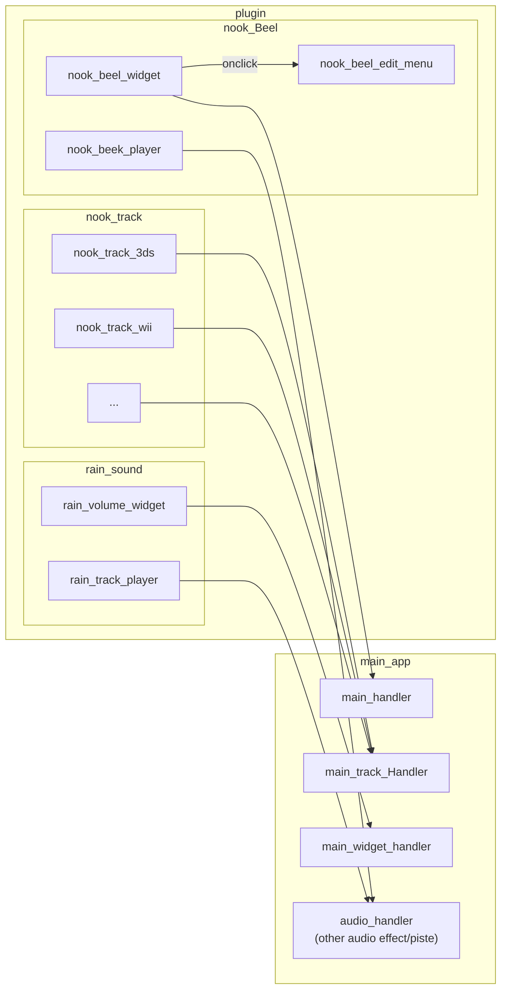

# Spec
this is what a planned for this app 

## Main idea
make a [nook desktop](https://github.com/mn6/nook-desktop) like cross-platform app but heavily moddable/hackable.

### exemple
to be feature equivalent to nook desktop it will be split like this



so basically :
 - main app 
   - widget placement
   - main track management
   - audio handler
 - widget
   - main track playlists
   - other track on top of the main one
   - widget logic

## interface
interface for plugin 

> prototype


``` typescript

interface widget { 
    name: string;
    minSize?: { width: number; height: number };
    maxSize?: { width: number; height: number };
    
    render: ReactComponent; // probably going to use a iframe of some kinf
}

interface playlist { 
    name: string;
    getTrack: () => AudioFile
}
```
